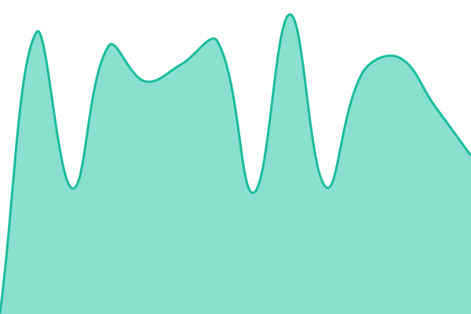

# [📈 Live Status](https://upptime.artemislena.eu): <!--live status--> **🟩 All systems operational**

This repository contains the open-source uptime monitor and status page for [Artemis](https://artemislena.eu), powered by [Upptime](https://github.com/upptime/upptime).

With [Upptime](https://upptime.js.org), you can get your own unlimited and free uptime monitor and status page, powered entirely by a GitHub repository. We use [Issues](https://github.com/artemislena/upptime/issues) as incident reports, [Actions](https://github.com/artemislena/upptime/actions) as uptime monitors, and [Pages](https://upptime.artemislena.eu) for the status page.

<!--start: status pages-->
<!-- This summary is generated by Upptime (https://github.com/upptime/upptime) -->
<!-- Do not edit this manually, your changes will be overwritten -->
<!-- prettier-ignore -->
| URL | Status | History | Response Time | Uptime |
| --- | ------ | ------- | ------------- | ------ |
|  [Main site](https://artemislena.eu) | 🟩 Up | [main-site.yml](https://github.com/artemislena/upptime/commits/HEAD/history/main-site.yml) | 

 535ms
     
 | 

<a href="https://upptime.artemislena.eu/history/main-site">100.00%</a>
    

|  [GTRR](https://gtrr.artemislena.eu) | 🟩 Up | [gtrr.yml](https://github.com/artemislena/upptime/commits/HEAD/history/gtrr.yml) | 

 592ms
     
 | 

<a href="https://upptime.artemislena.eu/history/gtrr">100.00%</a>
    

|  [BorgBackup](borg.artemislena.eu) | 🟩 Up | [borg-backup.yml](https://github.com/artemislena/upptime/commits/HEAD/history/borg-backup.yml) | 

 138ms
     
 | 

<a href="https://upptime.artemislena.eu/history/borg-backup">100.00%</a>
    

|  [Matrix (client)](https://matrix.artemislena.eu) | 🟩 Up | [matrix-client.yml](https://github.com/artemislena/upptime/commits/HEAD/history/matrix-client.yml) | 

 977ms
     
 | 

<a href="https://upptime.artemislena.eu/history/matrix-client">99.39%</a>
    

|  [Matrix (server)](https://matrix.artemislena.eu:8448/_matrix/static) | 🟩 Up | [matrix-server.yml](https://github.com/artemislena/upptime/commits/HEAD/history/matrix-server.yml) | 

 895ms
     
 | 

<a href="https://upptime.artemislena.eu/history/matrix-server">100.00%</a>
    

|  [Whoareyou](https://artemislena.eu/services/whoareyou.html) | 🟩 Up | [whoareyou.yml](https://github.com/artemislena/upptime/commits/HEAD/history/whoareyou.yml) | 

 382ms
     
 | 

<a href="https://upptime.artemislena.eu/history/whoareyou">100.00%</a>
    

|  [Send](https://send.artemislena.eu) | 🟩 Up | [send.yml](https://github.com/artemislena/upptime/commits/HEAD/history/send.yml) | 

 523ms
     
 | 

<a href="https://upptime.artemislena.eu/history/send">100.00%</a>
    

|  [Rimgo](https://imgur.artemislena.eu) | 🟩 Up | [rimgo.yml](https://github.com/artemislena/upptime/commits/HEAD/history/rimgo.yml) | 

 526ms
     
 | 

<a href="https://upptime.artemislena.eu/history/rimgo">100.00%</a>
    

|  [CryptPad](https://pad.artemislena.eu) | 🟩 Up | [crypt-pad.yml](https://github.com/artemislena/upptime/commits/HEAD/history/crypt-pad.yml) | 

 535ms
     
 | 

<a href="https://upptime.artemislena.eu/history/crypt-pad">100.00%</a>
    

|  [Ntfy](https://ntfy.artemislena.eu) | 🟩 Up | [ntfy.yml](https://github.com/artemislena/upptime/commits/HEAD/history/ntfy.yml) | 

 634ms
     
 | 

<a href="https://upptime.artemislena.eu/history/ntfy">100.00%</a>
    

|  [Mailcow (web)](https://mail.artemislena.eu) | 🟩 Up | [mailcow-web.yml](https://github.com/artemislena/upptime/commits/HEAD/history/mailcow-web.yml) | 

 914ms
     
 | 

<a href="https://upptime.artemislena.eu/history/mailcow-web">99.40%</a>
    

|  [Mailcow (SMTP)](mail.artemislena.eu) | 🟩 Up | [mailcow-smtp.yml](https://github.com/artemislena/upptime/commits/HEAD/history/mailcow-smtp.yml) | 

 149ms
     
 | 

<a href="https://upptime.artemislena.eu/history/mailcow-smtp">100.00%</a>
    

|  [Croc](croc.artemislena.eu) | 🟩 Up | [croc.yml](https://github.com/artemislena/upptime/commits/HEAD/history/croc.yml) | 

 116ms
     
 | 

<a href="https://upptime.artemislena.eu/history/croc">100.00%</a>
    

|  [BreezeWiki](https://bw.artemislena.eu) | 🟩 Up | [breeze-wiki.yml](https://github.com/artemislena/upptime/commits/HEAD/history/breeze-wiki.yml) | 

 505ms
     
 | 

<a href="https://upptime.artemislena.eu/history/breeze-wiki">100.00%</a>
    

|  [Redlib](https://red.artemislena.eu/info) | 🟩 Up | [redlib.yml](https://github.com/artemislena/upptime/commits/HEAD/history/redlib.yml) | 

 626ms
     
 | 

<a href="https://upptime.artemislena.eu/history/redlib">98.95%</a>
    

|  [Jitsi](https://jitsi.artemislena.eu) | 🟩 Up | [jitsi.yml](https://github.com/artemislena/upptime/commits/HEAD/history/jitsi.yml) | 

 671ms
     
 | 

<a href="https://upptime.artemislena.eu/history/jitsi">100.00%</a>
    

|  [GoToSocial](https://social.artemislena.eu) | 🟩 Up | [go-to-social.yml](https://github.com/artemislena/upptime/commits/HEAD/history/go-to-social.yml) | 

 662ms
     
 | 

<a href="https://upptime.artemislena.eu/history/go-to-social">100.00%</a>
    

|  [Syncplay](syncplay.artemislena.eu) | 🟩 Up | [syncplay.yml](https://github.com/artemislena/upptime/commits/HEAD/history/syncplay.yml) | 

 135ms
     
 | 

<a href="https://upptime.artemislena.eu/history/syncplay">100.00%</a>
    

|  [Dumb](https://dumb.artemislena.eu) | 🟩 Up | [dumb.yml](https://github.com/artemislena/upptime/commits/HEAD/history/dumb.yml) | 

 460ms
     
 | 

<a href="https://upptime.artemislena.eu/history/dumb">100.00%</a>
    

<!--end: status pages-->

[**Visit our status website →**](https://upptime.artemislena.eu)

## 📄 License

- Powered by: [Upptime](https://github.com/upptime/upptime)
- Code: [MIT](./LICENSE) © [Artemis](https://artemislena.eu)
- Data in the `./history` directory: [Open Database License](https://opendatacommons.org/licenses/odbl/1-0/)
