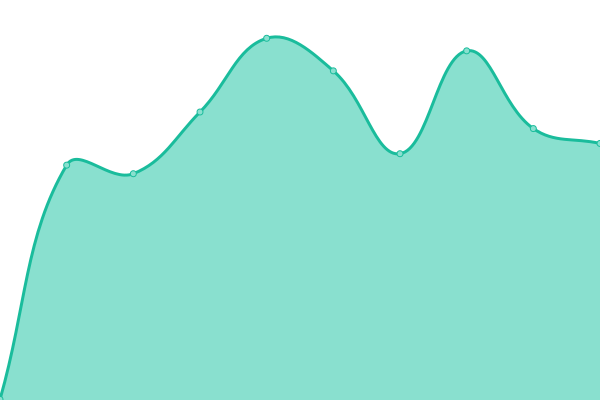

# [📈 Live Status](https://upptime.artemislena.eu): <!--live status--> **🟩 All systems operational**

This repository contains the open-source uptime monitor and status page for [Artemis](https://artemislena.eu), powered by [Upptime](https://github.com/upptime/upptime).

With [Upptime](https://upptime.js.org), you can get your own unlimited and free uptime monitor and status page, powered entirely by a GitHub repository. We use [Issues](https://github.com/artemislena/upptime/issues) as incident reports, [Actions](https://github.com/artemislena/upptime/actions) as uptime monitors, and [Pages](https://upptime.artemislena.eu) for the status page.

<!--start: status pages-->
<!-- This summary is generated by Upptime (https://github.com/upptime/upptime) -->
<!-- Do not edit this manually, your changes will be overwritten -->
<!-- prettier-ignore -->
| URL | Status | History | Response Time | Uptime |
| --- | ------ | ------- | ------------- | ------ |
|  [Main site](https://artemislena.eu) | 🟩 Up | [main-site.yml](https://github.com/artemislena/upptime/commits/HEAD/history/main-site.yml) | 

 570ms
     
 | 

<a href="https://upptime.artemislena.eu/history/main-site">100.00%</a>
    

|  [GTRR](https://gtrr.artemislena.eu) | 🟩 Up | [gtrr.yml](https://github.com/artemislena/upptime/commits/HEAD/history/gtrr.yml) | 

 556ms
     
 | 

<a href="https://upptime.artemislena.eu/history/gtrr">100.00%</a>
    

|  [BorgBackup](borg.artemislena.eu) | 🟩 Up | [borg-backup.yml](https://github.com/artemislena/upptime/commits/HEAD/history/borg-backup.yml) | 

 158ms
     
 | 

<a href="https://upptime.artemislena.eu/history/borg-backup">100.00%</a>
    

|  [Matrix (client)](https://matrix.artemislena.eu) | 🟩 Up | [matrix-client.yml](https://github.com/artemislena/upptime/commits/HEAD/history/matrix-client.yml) | 

 1278ms
     
 | 

<a href="https://upptime.artemislena.eu/history/matrix-client">99.65%</a>
    

|  [Matrix (server)](https://matrix.artemislena.eu:8448/_matrix/static) | 🟩 Up | [matrix-server.yml](https://github.com/artemislena/upptime/commits/HEAD/history/matrix-server.yml) | 

 843ms
     
 | 

<a href="https://upptime.artemislena.eu/history/matrix-server">99.82%</a>
    

|  [Whoareyou](https://artemislena.eu/services/whoareyou.html) | 🟩 Up | [whoareyou.yml](https://github.com/artemislena/upptime/commits/HEAD/history/whoareyou.yml) | 

 378ms
     
 | 

<a href="https://upptime.artemislena.eu/history/whoareyou">100.00%</a>
    

|  [Plik](https://plik.artemislena.eu) | 🟩 Up | [plik.yml](https://github.com/artemislena/upptime/commits/HEAD/history/plik.yml) | 

 459ms
     
 | 

<a href="https://upptime.artemislena.eu/history/plik">100.00%</a>
    

|  [Teddit](https://teddit.artemislena.eu) | 🟩 Up | [teddit.yml](https://github.com/artemislena/upptime/commits/HEAD/history/teddit.yml) | 

 1199ms
     
 | 

<a href="https://upptime.artemislena.eu/history/teddit">99.48%</a>
    

|  [Invidious](https://yt.artemislena.eu) | 🟩 Up | [invidious.yml](https://github.com/artemislena/upptime/commits/HEAD/history/invidious.yml) | 

 2173ms
     
 | 

<a href="https://upptime.artemislena.eu/history/invidious">89.43%</a>
    

|  [Nitter](https://tw.artemislena.eu) | 🟩 Up | [nitter.yml](https://github.com/artemislena/upptime/commits/HEAD/history/nitter.yml) | 

 1160ms
     
 | 

<a href="https://upptime.artemislena.eu/history/nitter">89.44%</a>
    

|  [Rimgo](https://imgur.artemislena.eu) | 🟩 Up | [rimgo.yml](https://github.com/artemislena/upptime/commits/HEAD/history/rimgo.yml) | 

 922ms
     
 | 

<a href="https://upptime.artemislena.eu/history/rimgo">99.31%</a>
    

|  [CryptPad](https://pad.artemislena.eu) | 🟩 Up | [crypt-pad.yml](https://github.com/artemislena/upptime/commits/HEAD/history/crypt-pad.yml) | 

 964ms
     
 | 

<a href="https://upptime.artemislena.eu/history/crypt-pad">99.31%</a>
    

|  [Ntfy](https://ntfy.artemislena.eu) | 🟩 Up | [ntfy.yml](https://github.com/artemislena/upptime/commits/HEAD/history/ntfy.yml) | 

 933ms
     
 | 

<a href="https://upptime.artemislena.eu/history/ntfy">99.31%</a>
    

|  [Mailcow (web)](https://mail.artemislena.eu) | 🟩 Up | [mailcow-web.yml](https://github.com/artemislena/upptime/commits/HEAD/history/mailcow-web.yml) | 

 4788ms
     
 | 

<a href="https://upptime.artemislena.eu/history/mailcow-web">100.00%</a>
    

|  [Mailcow (SMTP)](mail.artemislena.eu) | 🟩 Up | [mailcow-smtp.yml](https://github.com/artemislena/upptime/commits/HEAD/history/mailcow-smtp.yml) | 

 137ms
     
 | 

<a href="https://upptime.artemislena.eu/history/mailcow-smtp">100.00%</a>
    

|  [Croc](croc.artemislena.eu) | 🟩 Up | [croc.yml](https://github.com/artemislena/upptime/commits/HEAD/history/croc.yml) | 

 119ms
     
 | 

<a href="https://upptime.artemislena.eu/history/croc">100.00%</a>
    

|  [BreezeWiki](https://bw.artemislena.eu) | 🟩 Up | [breeze-wiki.yml](https://github.com/artemislena/upptime/commits/HEAD/history/breeze-wiki.yml) | 

 886ms
     
 | 

<a href="https://upptime.artemislena.eu/history/breeze-wiki">99.31%</a>
    

|  [Libreddit](https://lr.artemislena.eu) | 🟩 Up | [libreddit.yml](https://github.com/artemislena/upptime/commits/HEAD/history/libreddit.yml) | 

 2017ms
     
 | 

<a href="https://upptime.artemislena.eu/history/libreddit">99.49%</a>
    

<!--end: status pages-->

[**Visit our status website →**](https://upptime.artemislena.eu)

## 📄 License

- Powered by: [Upptime](https://github.com/upptime/upptime)
- Code: [MIT](./LICENSE) © [Artemis](https://artemislena.eu)
- Data in the `./history` directory: [Open Database License](https://opendatacommons.org/licenses/odbl/1-0/)
